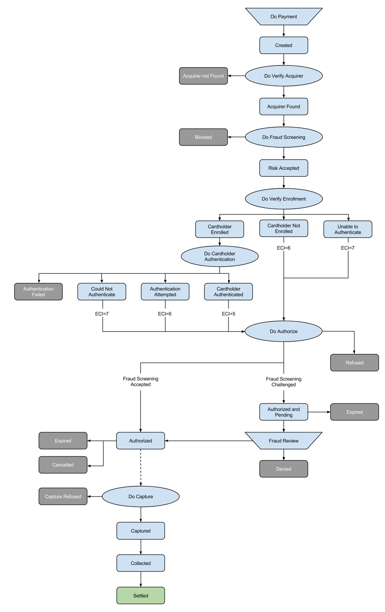

.. _AppendixB-PaymentStatus:

.. _Appendix B:

========================================
Appendix B - Payment Status Definitions
========================================

This is a list of the various payment status names and a description of what each payment status name means.

.. table:: Table: Transaction statuses
  :class: table-with-wrap

  =======  ===============================  =====================
  Code     Status                           Description
  =======  ===============================  =====================
  101      Created                          The payment attempt was created.
  103      Cardholder Enrolled              Card is enrolled in the :term:`3-D Secure` program. The merchant has to forward the cardholder to the authentication pages of the card issuer.
  104      Cardholder Not Enrolled          Card is not enrolled in 3-D Secure program.
  105      Unable to Authenticate           Unable to complete the authentication request.
  106      Cardholder Authenticated	        Cardholder was successfully authenticated in the 3-D Secure program.
  107      Authentication Attempted	        The Merchant has attempted to authenticate the cardholder in the 3-D Secure program and either the Issuer or cardholder is not enrolled.
  108      Could Not Authenticate	        The Issuer is not able to complete the authentication request.
  109      Authentication Failed	        Cardholder authentication failed. Authorization request should not be submitted. *An authentication failure may be a possible indication of a fraudulent user.*
  110      Blocked	                        The transaction has been rejected for reasons of suspected fraud.
  111      Denied	                        Merchant denied the payment attempt. After reviewing the fraud screening result, the merchant decided to decline the payment.
  112      Authorized and Pending	        The payment was challenged by the fraud rule set and is pending.
  113      Refused	                        The financial institution refused to authorize the payment. The refusal reasons can be: an exceeded credit limit, an incorrect expiry date, insufficient balance, or many other depending on the selected payment method.
  114      Expired	                        The validity period of the payment authorization has expired. This happens when no capture request is submitted for an authorized payment typically within 7 days after authorization. *Note: Depending on the customer's issuing bank, the authorization validity period may last from 1-5 days for a debit card and up to 30 days for a credit card.*
  115      Cancelled                        Merchant cancelled the payment attempt. You can only cancel payments with status "Authorized" and that have not yet reached the status "Captured". In the case of a credit card payment, cancelling the transaction consists in voiding the :term:`authorization`.
  116      Authorized                       The financial institution has approved the payment. In the case of a credit card payment, funds are "held" and deducted from the customer's credit limit (or bank balance, in the case of a debit card) but are not yet transferred to the merchant. In the case of bank transfers and some other payment methods, the payment immediately obtains the status "Captured" after being set to "Authorized".
  117      :term:`Capture` Requested        A capture request has been sent to the financial institution.
  118      Captured	                        The financial institution has processed the payment. The funds will be transferred to HiPay TPP before being settled to your bank account. Authorized payments can be captured as long as the authorization has not expired. Some payment methods, like bank transfers or direct debits, reach the "Captured" status straight away after being authorized.
  119      Partially Captured	            The financial institution has processed part of the payment. If only part of the order can be shipped, it is allowed to capture an amount equal to the shipped part of the order. This is called a partial capture. *Note: Remember! As all credit card companies dictate, it is not allowed for a merchant to capture a payment before shipping has completed. Merchant should start shipping the order once the status "Authorized" is reached!*
  120      Collected	                    The funds have been made available for remittance to the merchant. A payment with the status "Collected" is ready to be paid out. HiPay TPP either will transfer the amount to your bank account within the next few days (depends on your settlement frequency), or the amount is already transferred to your bank account.
  121      Partially Collected	            A part of the transaction has been collected.
  122      Settled	                        The financial operations linked to this transaction are closed. Funds have been debited or credited from your merchant account at Hipay.
  123      Partially Settled                A part of the financial operations linked to this transaction is closed.
  124      :term:`Refund` Requested         A refund request has been sent to the financial institution.
  125      Refunded	                        The payment was refunded. A payment obtains the status "Refunded" when the financial institution processed the refund and the amount has been transferred to the shopper's account. The amount will be deducted from the next total amount, to be paid out to the merchant.
  126      Partially Refunded	            A part of the transaction has been refunded.
  129      Charged Back	                    The cardholder reversed a capture processed by their bank or credit card company. For instance, the cardholder contacts his credit card company and denies having made the transaction. The credit card company then revokes the already captured payment. Please note the legal difference between the shopper (who ordered the goods) and the cardholder (who owns the credit card and ends up paying for the order).In general, charge backs only occurs incidentally. When they do, a contact with the shopper can often solve the situation. Occasionally it is an indication of credit card fraud.
  131      Debited	                        The acquirer has informed us that a debit linked to the transaction is going to be applied.
  132      Partially Debited                The acquirer has informed us that a partial debit linked to the transaction is going to be applied.
  140      Authentication Requested         The payment method used requires authentication, authentication request was send and system is waiting for a customers’ action.
  141      Authenticated	                The payment method used requires authentication and it was successful.
  142      Authorization Requested          The payment method used requires an authorization request; the request was send and the system is waiting for the financial institution approval.
  150      Acquirer Found                   The acquirer payment route has been found.
  151      Acquirer not Found               The acquirer payment route has not been found.
  160      Cardholder Enrollment Unknown    Unable to verify if the card is enrolled in the 3-D Secure program.
  161      Risk Accepted                    The payment has been accepted by the fraud rule set.
  163      Authorization Refused            The authorization was refused by the financial institution.
  173      Capture Refused                  The capture was refused by the financial institution.
  200      Pending Payment	                The transaction request was submitted to the acquirer but response is not yet available.
  =======  ===============================  =====================

----------------------
Transaction Life Cycle
----------------------

Description
  The life cycle of a transaction processed by the HiPay TPP Payment Service is characterised by the different events that mark a change in the status of the transaction.
  These events and the resulting changes in transaction status play a crucial role in the payment process. All financial reporting is based on the status of transactions and any possible action for a transaction, whether performed by the merchant, the financial institution or by the payment system, depends on the actual status.

Diagram
  The following diagram shows the typical flow of a transaction through the different main payment statuses.

   Figure: Typical Transaction Flow with 3-D Secure authentication
