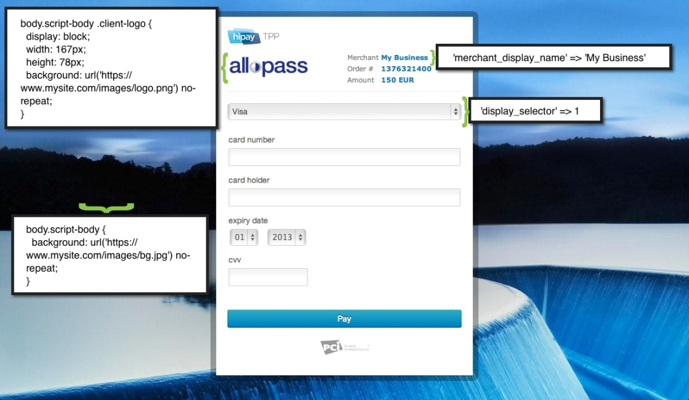

.. _Chap3-RESTAPIResources:

==============================
Chapter 3 - REST API Resources
==============================

The following table lists the REST API resources used.

==================================================================  =======================================================
Resource        		                                            Description
==================================================================  =======================================================
**POST**  /rest/v1/order	                                        Request a new order.
**POST**  /rest/v1/maintenance/transaction/{transaction_reference}  Perform a maintenance on an existing :term:`transaction`
**POST**  /rest/v1/hpayment		                                    Request an order and initialize a :term:`hosted payment page` 
**GET**   /rest/v1/transaction						                Request information about an existant transaction.
==================================================================  =======================================================

-------------------
Request a New Order
-------------------

Overview
  To request a new order, make an HTTP POST request to the following resource URL.
  POST /rest/v1/order

Order Parameters
----------------

.. table:: Table: Order-related parameters

  ====================  ===========  =======  ========  =====================================================================================================================================================================================================================================================================
  Field Name        	Format [1]_  Length   Req [2]_  Description
  ====================  ===========  =======  ========  =====================================================================================================================================================================================================================================================================
  orderid               AN           32       M         Unique order id
  :term:`operation`     AN                              Transaction type.
                                                        Indicates how you want to process the payment. The default transaction type is set in the Merchant Interface (Default payment procedure in the Integration section). A transaction type sent along with the transaction will overwrite the default payment procedure.
                                                        - **Sale** indicates transaction is sent for :term:`authorization`, and if approved, is automatically submitted for capture.
                                                        - **Authorization** indicates this transaction is sent for authorization only. The transaction will not be sent for settlement until the transaction is submitted for capture manually by the Merchant
  payment_product       AN                    M         The payment product (e.g., visa, mastercard, ideal).
                                                        Depending on the :term:`payment product`, elements specific to the payment method are required (see following tables).
                                                        Refer to the appendices —*"Appendix A. Payment Products”*— for the full list of available payment products.
  description           AN           255      M         The order short description.
  long_description      AN                              Additional order description.
  currency              A            3        M         Base currency for this order (Default to EUR).
                                                        This three-character currency code complies with ISO 4217.
  amount                R                     M         The total order amount. It should be calculated as a sum of the items purchased, plus the shipping fee (if present), plus the tax fee (if present).
  shipping              R                               The order shipping fee (Default to zero).
                                                        It can be omitted if the shipping fee value is zero.
  tax                   R                               The order tax fee (Default to zero).
                                                        It can be omitted if the order tax value is zero.
  cid                   AN                    M         Unique customer id.
                                                        *For fraud detection reasons.*
  ipaddr                AN                    M         The IP address of your customer making a purchase.
  accept_url            AN                              The URL to return your customer to once the payment process is completed successfully.
  decline_url           AN                              The URL to return your customer to after the acquirer declines the payment.
  pending_url           AN                              The URL to return your customer to when the payment request was submitted to the acquirer but response is not yet available.
  exception_url         AN                              The URL to return your customer to after a system failure.
  cancel_url            AN                              The URL to return your customer to when he or her decides to abort the payment.
  http_accept           AN                              This element should contain the exact content of the HTTP "Accept" header as sent to the merchant from the customer's browser (Default to "*/*").
  http_user_agent       AN                              This element should contain the exact content of the HTTP "User-Agent" header as sent to the merchant from the customer's browser (Default to "Mozilla/4.0 (compatible; MSIE 6.0; Windows NT 5.0)").
  device_fingerprint    AN                              This element should contain the value of the “ioBB” hidden field. (Please refer to *“Chapter 8: Device fingerprint integration”*)
  language              AN                              Locale code of your customer (Default to **en_GB** – English – Great Britain).
                                                        It may be used for sending confirmation emails to your customer or for displaying payment pages.

                                                        Examples:
                                                        - en_GB
                                                        - fr_FR
                                                        - es_ES
                                                        - it_IT
                                                        - …
  cdata1                AN                              Custom data. You may use these parameters to submit values you wish to receive back in the API response messages or in the notifications, e.g. you can use these parameters to get back session data, order content or user info.
  cdata2
  cdata3
  cdata4
  ====================  ===========  =======  ========  =====================================================================================================================================================================================================================================================================

Customer Parameters
-------------------
Overview
  The merchant can/must send the following customer information along with the transaction details.

The following table lists the customer related parameters

.. table:: Table: Customer-related parameter

  ====================  ===========  =======  ========  =====================================================================================================================================================================
  Field Name            Format [1]_  Length   Req [2]_  Description
  ====================  ===========  =======  ========  =====================================================================================================================================================================
  email                 AN                    M         The customer's e-mail address.
  phone                 AN                              The customer's phone number.
  birthdate             N            8                  Birth date of the customer (YYYYMMDD).
                                                        **For fraud detection reasons.**
  birthdate             A            1                  Gender of the customer (M=male, F=female, U=unknown).
  firstname	            AN                    M         The customer's first name.
  lastname              AN                    M         The customer's last name.
  recipientinfo         AN                              Additional information about the customer (e.g., quality or function, company name, department, etc.).
  streetaddress         AN                              Street address of the customer.
                                                        It can be omitted if the shipping fee value is zero.
  streetaddress2        AN                              Additional address information of the customer (e.g., building, floor, flat, etc.).
  city                  AN                              The customer's city.
  state                 AN                              The USA state or the Canada state of the customer making the purchase. Send this information only if the address country of the customer is US (USA) or CA (Canada).
  zipcode               AN                              The zip or postal code of the customer.
  country               A            2        M         The country code of the customer.
                                                        This two-letter country code complies with ISO 3166-1 (alpha 2).
  ====================  ===========  =======  ========  =====================================================================================================================================================================

The following table lists the Parameters specific to shipping information

.. table:: Table: Parameters specific to shipping information

  ======================  =========  =======  =====================================================================================================================================================================
  Field Name        	  Format     Length   Description
  ======================  =========  =======  =====================================================================================================================================================================
  shipto_firstname        AN                  The first name of the order recipient.
  shipto_lastname         AN                  The last name of the order recipient.
  shipto_recipientinfo    AN                  Additional information about the order recipient (e.g., quality or function, company name, department, etc.).
  shipto_streetaddress    AN                  Street address to which the order is to be shipped.
  shipto_streetaddress2   AN                  The additional information about address to which the order is to be shipped (e.g., building, floor, flat, etc.).
  shipto_city             AN                  The city to which the order is to be shipped.
  shipto_state            AN                  The USA state or Canada state to which the order is being shipped. Send this information only if the shipping country is US (USA) or CA (Canada).
  shipto_zipcode          AN                  The zip or postal code to which the order is being shipped
  shipto_country          A           2       Country code to which the order is being shipped.This two-letter country code complies with ISO 3166-1 (alpha 2).
  ======================  =========  =======  =====================================================================================================================================================================

Parameters specific to the payment product
------------------------------------------
Overview
  Depending on the payment product, the Merchant is supposed to send additional request parameters.

The following table lists the Parameters specific to credit or debit card payments.

.. table:: Table: Parameters specific to credit or debit card payments

  =========================  ===========  =======  ========  =====================================================================================================================================================================
  Field Name        	     Format [1]_  Length   Req [2]_  Description
  =========================  ===========  =======  ========  =====================================================================================================================================================================
  cardtoken                  AN           40       M         Card token.
                                                             For further details about the card token and its integration, refer to the Secure Vault :term:`API` documentation.
  :term:`eci`                N            1                  Electronic Commerce Indicator (ECI).
                                                             The ECI indicates the security level at which the payment information is processed between the cardholder and merchant.
                                                             Possible values:
                                                             - 1 = MO/TO (Card Not Present)
                                                             - 2 = MO/TO – Recurring
                                                             - 3 = Instalment Payment
                                                             - 4 = Manually Keyed (Card Present)
                                                             - 7 = E-commerce with :term:`SSL`/TLS Encryption
                                                             - 9 = Recurring E-commerce
                                                             
															 A default ECI value can be set in the preferences page. An ECI value sent along in the transaction will overwrite the default ECI value. Refer to the appendices (Appendix C) to get further information.

  authentication_indicator   N            1                  Indicates if the :term:`3-D Secure` authentication should be performed. Can be used to overrule the merchant level configuration.
                                                             - 0 = Bypass authentication
                                                             - 1 = Continue if possible (Default)
  =========================  ===========  =======  ========  =====================================================================================================================================================================

The following table lists the Parameters specific to Qiwi Wallet

.. table:: Table: Parameters specific to Qiwi Wallet

  =========================  ===========  =======  ========  ===============================================================================
  Field Name        	     Format [1]_  Length   Req [2]_  Description
  =========================  ===========  =======  ========  ===============================================================================
  qiwiuser                   AN           12       M         The Qiwi user's ID, to whom the invoice is issued.
                                                             It is the user's phone number, in international format. Example: +79263745223
  =========================  ===========  =======  ========  ===============================================================================

The following table lists the Parameters specific to iDeal

.. table:: Table: Parameters specific to iDeal

  =========================  =======  =======  ====  =================================
  Field Name        	     Format   Length   Req   Description
  =========================  =======  =======  ====  =================================
  issuer_bank_id             AN        4       M     Issuers' bank Id list [ref1]_
  =========================  =======  =======  ====  =================================

.. [ref1] Table:Issuers’ bank Id list

===========  ===================
Field Name   Bank description
===========  ===================
ABNANL2A     ABN AMRO
INGBNL2A     ING
RABONL2U     Rabobank
SNSBNL2A     SNS Bank
ASNBNL21     ASN Bank
FRBKNL2L     Friesland Bank
KNABNL2H     Knab
RBRBNL21     SNS Regio Bank
TRIONL2U     Triodos bank
FVLBNL22     Van Lanschot
===========  ===================

Response Fields
---------------

Overview
  Depending on the :term:`payment product`, the Merchant is supposed to send additional request parameters.

The following table lists and describes the response fields.

============================  =====================================================================================================================================================================
Field Name                    Description
============================  =====================================================================================================================================================================
state                         Transaction state.

                              Value must be a member of the following list.

                              - completed
                              - forwarding
                              - pending
                              - declined
                              - error

                              Please report to the following section below — Transaction Workflow — for further details.
----------------------------  ---------------------------------------------------------------------------------------------------------------------------------------------------------------------
reason                        Optional element. Reason why transaction was declined.
code                          Reason code as described in the appendices.
message                       Reason description.
----------------------------  ---------------------------------------------------------------------------------------------------------------------------------------------------------------------
forwardUrl (json)
---------------------------------------------------------------------------------------------------------------------------------------------------------------------------------------------------
forward_url (xml)             Optional element. Merchant must redirect the customer's browser to this URL.
----------------------------  ---------------------------------------------------------------------------------------------------------------------------------------------------------------------
test                          True if the transaction is a testing transaction, otherwise false.
mid                           Your merchant account number (issued to you by HiPay TPP).
----------------------------  ---------------------------------------------------------------------------------------------------------------------------------------------------------------------
attemptId (json)
---------------------------------------------------------------------------------------------------------------------------------------------------------------------------------------------------
attempt_id (xml)              Attempt id of the payment.
----------------------------  ---------------------------------------------------------------------------------------------------------------------------------------------------------------------
authorizationCode (json)
---------------------------------------------------------------------------------------------------------------------------------------------------------------------------------------------------
authorization_code (xml)      An :term:`authorization` code (up to 35 characters) generated for each approved or pending transaction by the acquiring provider.
----------------------------  ---------------------------------------------------------------------------------------------------------------------------------------------------------------------
transactionReference (json)
---------------------------------------------------------------------------------------------------------------------------------------------------------------------------------------------------
transaction_reference (xml)   the unique identifier of the transaction.
----------------------------  ---------------------------------------------------------------------------------------------------------------------------------------------------------------------
referenceToPay (json)
---------------------------------------------------------------------------------------------------------------------------------------------------------------------------------------------------
reference_to_pay (xml)        In some payment methods the customer can receive a reference to pay, at this point, the customer has the option to physically paying with cash at any bank branch, or at authorized processors such as drugstores, supermarkets or post offices, or paying electronically at an electronic banking point.
----------------------------  ---------------------------------------------------------------------------------------------------------------------------------------------------------------------
dateCreated (json)
---------------------------------------------------------------------------------------------------------------------------------------------------------------------------------------------------
date_created (xml)            Time when transaction was created.
----------------------------  ---------------------------------------------------------------------------------------------------------------------------------------------------------------------
dateUpdated (json)
---------------------------------------------------------------------------------------------------------------------------------------------------------------------------------------------------
date_updated (xml)            Time when transaction was last updated.
----------------------------  ---------------------------------------------------------------------------------------------------------------------------------------------------------------------
dateAuthorized (json)
---------------------------------------------------------------------------------------------------------------------------------------------------------------------------------------------------
date_authorized (xml)         Time when transaction was authorized.
----------------------------  ---------------------------------------------------------------------------------------------------------------------------------------------------------------------
status                        Transaction status. A list of available statuses can be found in the appendices — **Table:Transaction statuses**
message                       Transaction message.
----------------------------  ---------------------------------------------------------------------------------------------------------------------------------------------------------------------
authorizedAmount (json)
---------------------------------------------------------------------------------------------------------------------------------------------------------------------------------------------------
authorized_amount (xml)       The transaction amount.
----------------------------  ---------------------------------------------------------------------------------------------------------------------------------------------------------------------
capturedAmount (json)
---------------------------------------------------------------------------------------------------------------------------------------------------------------------------------------------------
captured_amount (xml)         Captured amount.
----------------------------  ---------------------------------------------------------------------------------------------------------------------------------------------------------------------
refunded_amount (xml)         Refunded amount.
----------------------------  ---------------------------------------------------------------------------------------------------------------------------------------------------------------------
decimals                      Decimal precision of transaction amount.
currency                      Base currency for this transaction.
                              This three-character currency code complies with ISO 4217.
----------------------------  ---------------------------------------------------------------------------------------------------------------------------------------------------------------------
ipAddress (json)
---------------------------------------------------------------------------------------------------------------------------------------------------------------------------------------------------
ip_address (xml)              The IP address of the customer making the purchase.
----------------------------  ---------------------------------------------------------------------------------------------------------------------------------------------------------------------
ipCountry (json)
---------------------------------------------------------------------------------------------------------------------------------------------------------------------------------------------------
ip_country (xml)              Country code associated to the customer's IP address.
----------------------------  ---------------------------------------------------------------------------------------------------------------------------------------------------------------------
deviceId (json)
---------------------------------------------------------------------------------------------------------------------------------------------------------------------------------------------------
device_id (xml)               Unique identifier assigned to device (the customer's brower) by HiPay TPP.
----------------------------  ---------------------------------------------------------------------------------------------------------------------------------------------------------------------
cdata1                        Custom data.
cdata2                        Custom data.
cdata3                        Custom data.
cdata4                        Custom data.
----------------------------  ---------------------------------------------------------------------------------------------------------------------------------------------------------------------
avs_result (xml)              Result of the Address Verification Service (AVS).Possible result codes can be found in the appendices
----------------------------  ---------------------------------------------------------------------------------------------------------------------------------------------------------------------
cvcResult (json)
---------------------------------------------------------------------------------------------------------------------------------------------------------------------------------------------------
cvc_result (xml)              Result of the CVC (Card Verification Code) check. Possible result codes can be found in the appendices
----------------------------  ---------------------------------------------------------------------------------------------------------------------------------------------------------------------
:term:`eci`                   Electronic Commerce Indicator (ECI).
----------------------------  ---------------------------------------------------------------------------------------------------------------------------------------------------------------------
paymentProduct (json)
---------------------------------------------------------------------------------------------------------------------------------------------------------------------------------------------------
payment_product (xml)         Payment product used to complete the transaction.Informs about the payment_method section type.
----------------------------  ---------------------------------------------------------------------------------------------------------------------------------------------------------------------
paymentMethod (json)
---------------------------------------------------------------------------------------------------------------------------------------------------------------------------------------------------
payment_method (xml)          See tables below for further details.
----------------------------  ---------------------------------------------------------------------------------------------------------------------------------------------------------------------
threeDSecure (json)
---------------------------------------------------------------------------------------------------------------------------------------------------------------------------------------------------
three_d_secure (xml)          Optional element. Result of the :term:`3-D Secure` Authentication

- enrollmentStatus (json)
---------------------------------------------------------------------------------------------------------------------------------------------------------------------------------------------------
- enrollment_status (xml)     The enrollment status.
- enrollmentMessage (json)
---------------------------------------------------------------------------------------------------------------------------------------------------------------------------------------------------
- enrollment_message (xml)    The enrollment status.
----------------------------  ---------------------------------------------------------------------------------------------------------------------------------------------------------------------
fraudScreening (json)
---------------------------------------------------------------------------------------------------------------------------------------------------------------------------------------------------
fraud_screening (xml)         Result of the :term:`fraud screening` .
- scoring                     - total score assigned to the transaction (main risk indicator).
----------------------------  ---------------------------------------------------------------------------------------------------------------------------------------------------------------------
- result                      The overall result of risk assessment returned by the Payment Gateway.
                              Value must be a member of the following list.:
                              - pending: rules were not checked.
                              - accepted: transaction accepted.
                              - blocked: transaction rejected due to system rules.
                              - term:`challenged`:	transaction has been marked for review.
----------------------------  ---------------------------------------------------------------------------------------------------------------------------------------------------------------------
- review                      The decision made when the overall risk result returns challenged.
                              An empty value means no review is required.
                              Value must be a member of the following list.
                              - pending: a decision to release or cancel the transaction is pending.
                              - allowed: the transaction has been released for processing.
                              - denied: the transaction has been cancelled.
----------------------------  ---------------------------------------------------------------------------------------------------------------------------------------------------------------------
Order                         Information about the customer and his order.
- Id                          - unique identifier of the order as provided by Merchant.
- dateCreated (json)
- date_created (xml)          - time when order was created.
- attempts                    - indicates how many payment attempts have been made for this order.
- amount                      - the total order amount (e.g., 150.00). It should be calculated as a sum of the items purchased, plus the shipping fee (if present), plus the tax fee (if present).
- shipping                    - the order shipping fee.
- tax                         - the order tax fee
- decimals                    - decimal precision of the order amount base currency for this order
- currency                    - This three-character currency code complies with ISO 4217.
- customerId (json)
---------------------------------------------------------------------------------------------------------------------------------------------------------------------------------------------------
- customer_id (xml)           - unique identifier of the customer as provided by Merchant.
- language                    - language code of the customer.
- email                       - email address of the customer.
============================  =====================================================================================================================================================================

Response fields specific to the :term:`payment product`
-------------------------------------------------------
Credit Card payments
  The following table lists and describes the response fields returned for transactions by credit/debit card.

=========================  =====================================================================================================================================================================
Field Name                 Description
=========================  =====================================================================================================================================================================
:term:`token`              Card token
-------------------------  ---------------------------------------------------------------------------------------------------------------------------------------------------------------------
brand                      Card brand. (e.g., VISA, MASTERCARD, AMERICANEXPRESS, MAESTRO).
pan                        Card number (up to 19 characters). Note that, due to the :term:`PCI DSS` security standards, our system has to mask credit card numbers in any output (e.g., 549619******4769).
-------------------------  ---------------------------------------------------------------------------------------------------------------------------------------------------------------------
cardHolder (json)
------------------------------------------------------------------------------------------------------------------------------------------------------------------------------------------------
card_holder (xml)          Cardholder name.
-------------------------  ---------------------------------------------------------------------------------------------------------------------------------------------------------------------
cardExpiryMonth (json)
------------------------------------------------------------------------------------------------------------------------------------------------------------------------------------------------
card_expiry_month (xml)    Card expiry month (2 digits).
-------------------------  ---------------------------------------------------------------------------------------------------------------------------------------------------------------------
cardExpiryYear (json)
------------------------------------------------------------------------------------------------------------------------------------------------------------------------------------------------
card_expiry_year (xml)     Card expiry year (4 digits).
-------------------------  ---------------------------------------------------------------------------------------------------------------------------------------------------------------------
issuer                     Card issuing bank name.
                           Do not rely on this value to remain static over time. Bank names may change over time due to acquisitions and mergers.
country                    Bank country code where card was issued.
                           This two-letter country code complies with ISO 3166-1 (alpha 2).
=========================  =====================================================================================================================================================================

QIWI payments
  The following table lists and describes the response fields returned for transactions by VISA QIWI Wallet.

=========================  =====================================================================================================================================================================
Field Name                 Description
=========================  =====================================================================================================================================================================
user                       The Qiwi user's ID, to whom the invoice is issued.
                           It is the user's phone number, in international format. Example: 79263745223
=========================  =====================================================================================================================================================================

Transaction Workflow
--------------------
Overview
  The HiPay TPP payment gateway can process transactions through many different acquirers using different payment methods and involving some anti-fraud checks. All these aspects change the transaction processing flow significantly for you.

Description
  When you send a transaction request to the gateway, you receive a response describing the transaction state.

Depending on the transaction state there are five options to action:

.. table:: Table: Transaction states

  ==================  =====================================================================================================================================================================
  Translation state   Description
  ==================  =====================================================================================================================================================================
  completed           If the transaction state is completed you are done.
                      This is the most common case for credit card transaction processing. Almost all credit card acquirers works in that way. Then you have to look into the status fied of the response to know the exact transaction status.
  forwarding          If the transaction state is forwarding you have to redirect your customer to an URL provided in the forward_url field of the response. In that case the transaction processing is not yet done. You will have to wait until the customer returned to your website after doing all redirects.
  pending             Transaction request was submitted to the acquirer but response is not yet available.
  declined            Transaction was processed and was declined by gateway.
  error               Transaction was not processed due to some reasons.
  ==================  =====================================================================================================================================================================

-----------------------
Maintenance Operations
-----------------------

Description
  To perform maintenance on an existing transaction, make an HTTP POST request to the following resource (see :term:`Operation`)
  POST /rest/v1/maintenance/transaction/{transaction_reference}

The payment gateway supports the following types of maintenance transactions.

.. table:: Table: Types of maintenance transactions

  ==================  =============================================================================================================================================================================================================================================
  Operation Type      Description
  ==================  =============================================================================================================================================================================================================================================
  :term:`capture`     A request instructing the payment gateway to capture a previously-authorized transaction, i.e. transfer the funds from the customer's bank account to the merchant's bank account. This transaction is always preceded by an authorization.
  :term:`refund`      A request instructing the payment gateway to refund a previously captured transaction. A captured transaction can be partly or fully refunded.
  :term:`cancel`      A request instructing the payment gateway to cancel a previously-authorized transaction. Only authorized transactions can be canceled, captured transactions must be refunded.
  ==================  =============================================================================================================================================================================================================================================

URL Parameters
--------------

test

=========================  =======  =======  ====  ==========================================
Parameter        	       Format   Length   Req   Description
=========================  =======  =======  ====  ==========================================
{transaction_reference}    N                 M     The unique identifier of the transaction.
=========================  =======  =======  ====  ==========================================

Request Parameters
------------------

test

=========================  =======  =======  ====  ==========================================================================================================================================
Parameter        	       Format   Length   Req   Description
=========================  =======  =======  ====  ==========================================================================================================================================
:term:`operation`
{transaction_reference}    A                 M     The type of operation to process. For further information, report to the previous table - **Table 15: Types of maintenance transactions**
amount                     R                 C     Operation amount (e.g., 10.00). Amount is required for partial maintenances. Do not specify amount for full captures or refunds.
=========================  =======  =======  ====  ==========================================================================================================================================

Response Fields
---------------

The following table lists and describes the response fields.

============================  =====================================================================================================================================
Field Name                    Description
============================  =====================================================================================================================================
:term:`operation`             Value is fixed to :term:`capture`, :term:`refund` or :term:`cancel`
----------------------------  -------------------------------------------------------------------------------------------------------------------------------------
test                          True if the transaction is a testing transaction, otherwise false.
mid                           Your merchant account number (issued to you by HiPay TPP).
----------------------------  -------------------------------------------------------------------------------------------------------------------------------------
authorizationCode (json)
-------------------------------------------------------------------------------------------------------------------------------------------------------------------
authorization_code (xml)      An :term:`authorization` code (up to 35 characters) generated for each approved or pending transaction by the acquiring provider.
----------------------------  -------------------------------------------------------------------------------------------------------------------------------------
transactionReference (json)
-------------------------------------------------------------------------------------------------------------------------------------------------------------------
transaction_reference (xml)   The unique identifier of the transaction.
----------------------------  -------------------------------------------------------------------------------------------------------------------------------------
dateCreated (json)
-------------------------------------------------------------------------------------------------------------------------------------------------------------------
date_created (xml)            Time when transaction was created.
----------------------------  -------------------------------------------------------------------------------------------------------------------------------------
dateUpdated (json)
-------------------------------------------------------------------------------------------------------------------------------------------------------------------
date_updated (xml)            Time when transaction was last updated (maintenance date).
----------------------------  -------------------------------------------------------------------------------------------------------------------------------------
dateAuthorized (json)
-------------------------------------------------------------------------------------------------------------------------------------------------------------------
date_authorized (xml)         Time when transaction was authorized.
----------------------------  -------------------------------------------------------------------------------------------------------------------------------------
status                        Transaction status. A list of available statuses can be found in the appendices.
message                       Transaction message.
----------------------------  -------------------------------------------------------------------------------------------------------------------------------------
authorizedAmount (json)
-------------------------------------------------------------------------------------------------------------------------------------------------------------------
authorized_amount (xml)       The transaction amount.
----------------------------  -------------------------------------------------------------------------------------------------------------------------------------
capturedAmount (json)
-------------------------------------------------------------------------------------------------------------------------------------------------------------------
captured_amount (xml)         The captured amount.
----------------------------  -------------------------------------------------------------------------------------------------------------------------------------
refundedAmount
refunded_amount (xml)         The refunded amount.
----------------------------  -------------------------------------------------------------------------------------------------------------------------------------
decimals                      Decimal precision of transaction amount.
currency                      Base currency for this transaction. This three-character currency code complies with ISO 4217.
============================  =====================================================================================================================================

Examples
---------

The following are examples JSON and XML responses.

Example Request

.. code-block:: ini
    :linenos:

  	$ curl https://secure-gateway.allopass.com/rest/v1/maintenance/transaction/432241108734 \
  	    -u "<your API username>:<your API password>" \
   	    -X POST \
   	    -d "operation=capture" \
   	    -d "amount=10.00"

XML Response Example

.. code-block:: xml
    :linenos:

   	<response>
   	  <operation>capture</operation>
   	  <test>false</test>
   	  <mid>00001234567</mid>
   	  <authorization_code>549554</authorization_code>
   	  <transaction_reference>432241108734</transaction_reference>
   	  <date_created>2013-03-07T12:31:09+0000</date_created>
   	  <date_updated>2013-03-07T15:44:08+0000</date_updated>
   	  <date_authorized>2013-03-07T12:31:12+0000</date_authorized>
   	  <status>117</status>
   	  <message>Capture Requested</message>
   	  <authorized_amount>460.50</authorized_amount>
   	  <captured_amount>40.00</captured_amount>
   	  <refunded_amount>0.00</refunded_amount>
   	  <decimals>2</decimals>
   	  <currency>EUR</currency>
   	</response>

JSON Response Example

.. code-block:: json
    :linenos:

   	{
   	  "operation":"capture",
   	  "test":"false",
   	  "mid":"00001234567",
   	  "authorizationCode":"549554",
   	  "transactionReference":"432241108734",
   	  "dateCreated":"2013-03-07T12:31:09+0000",
   	  "dateUpdated":"2013-03-07T15:48:28+0000",
   	  "dateAuthorized":"2013-03-07T12:31:12+0000",
   	  "status":"117",
   	  "message":"Capture Requested",
   	  "authorizedAmount":"460.50",
   	  "capturedAmount":"50.00",
   	  "refundedAmount":"0.00",
   	  "decimals":"2",
   	  "currency":"EUR"   	
	}

----------------------------------------
Initialize a :term:`hosted payment page`
----------------------------------------

Introduction
  To perform a hosted payment page, first step consist to make an HTTP POST request to the following resource.
  POST /rest/v1/hpayment

Payment page Workflow
----------------------

Description
  This resource creates an order and returns a forward URL. This forward URL is dedicated to display a payment page with customers’ CSS and validated payment products. After payment form validation, the checkout is processed.
  According to transaction state and *authentication_indicator* parameter (*please refer to "3-D Secure" chapter on “GatewayAPI documentation"*), main window is redirect to accept or decline page.

 
Order on a Hosted Payment Page
------------------------------

==============================  ===========  =======  ========  ===============================================================================
Field Name        	            Format [1]_  Length   Req [2]_  Description
==============================  ===========  =======  ========  ===============================================================================
orderid                         AN           32       M         Unique order id
:term:`operation`                      AN           32       M         Transaction type. Indicates how you want to process the payment. The default transaction type is set in the Merchant Interface (Default payment procedure in the Integration section). A transaction type sent along with the transaction will overwrite the default payment procedure.
                                                                - **Sale** indicates transaction is sent for authorization, and if approved, is automatically submitted for :term:`capture`.
                                                                - **:term:`Authorization`** indicates this transaction is sent for authorization only. The transaction will not be sent for settlement until the transaction is submitted for :term:`capture` manually by the Merchant.
------------------------------  -----------  -------  --------  ------------------------------------------------------------------------------- 
:term:`eci`                     N            1                  Electronic Commerce Indicator (ECI).
                                                                The ECI indicates the security level at which the payment information is processed between the cardholder and merchant. 
                                                                Possible values:
                                                                1 = MO/TO (Card Not Present)
                                                                7 = E-commerce with :term:`SSL`/TLS Encryption
                                                                A default ECI value can be set in the preferences page. An ECI value sent along in the transaction will overwrite the default ECI value. Refer to the appendices — "Electronic Commerce Indicator” — on “GatewayAPI” documentation to get further information.
------------------------------  -----------  -------  --------  -------------------------------------------------------------------------------  
authentication_indicator        N            1                  Indicates if the :term:`3-D Secure` authentication should be performed for this transaction. Can be used to overrule the merchant level configuration.
                                                                0 = Bypass authentication
                                                                1 = Continue if possible 
------------------------------  -----------  -------  --------  -------------------------------------------------------------------------------                                                             
payment_product_list            AN           255                The payment product list separated by a “,” (e.g., visa,mastercard,american-express). *Refer to the appendices — " Appendix A— on “GatewayAPI” documentation for the full list of available payment products.*
payment_product_category_list   AN	         255	            The payment product category list separated by “,”. (e.g., credit-card,ewallet). \Refer to the appendices — "Appendix A. Payment Products” — on “GatewayAPI” documentation for the full list of available payment categories.*
css                             AN           255                URL to merchant style sheet. Important: H**TTPS** protocol is required.
template                        AN	         32	                The template name.
                                                                Possible values:
                                                                - basic-js = For a full page redirection.
                                                                - iframe-js = For an iframe integration.
merchant_display_
name                            AN	         32	                The merchant name displayed on payment page, otherwise the name is retrieved from order.
display_selector                N	         1	                Enable/disable the payment products selector.
                                                                Possible values:
                                                                0 = The selector is not displayed
                                                                1 = The selector is displayed
multi_use                       N	         1	                Indicates the tokenization module if the credit card token should be generated either for a single-use or a multi-use.
                                                                Possible values:
                                                                1 = Generate a multi-use token
                                                                0 = Generates a single-use token.
                                                                While a single-use token is typically generated for a short time and for processing a single transaction, multi-use tokens are generally generated for recurrent payments.
description                     AN           255      M         The order short description.	                
long_description                AN                              Additional order description.        
currency                        A            3        M         Base currency for this order (Default to EUR). This three-character currency code complies with ISO 4217.
amount                          R                     M         The total order amount. It should be calculated as a sum of the items purchased, plus the shipping fee (if present), plus the tax fee (if present). Minimal amount 1.00 EUR.
shipping                        R                               The order shipping fee (Default to zero). It can be omitted if the shipping fee value is zero.
tax                             R                               The order tax fee (Default to zero). It can be omitted if the order tax value is zero.
cid                             AN                    M         Unique customer id. *For fraud detection reasons.*
ipaddr                          AN                    M         The IP address of your customer making a purchase.
accept_url                      AN                    M         The URL to return your customer to once the payment process is completed successfully.         
decline_url                     AN                    M         The URL to return your customer to after the acquirer declines the payment. 
pending_url                     AN                    M         The URL to return your customer to when the payment request was submitted to the acquirer but response is not yet available.
exception_url                   AN                    M         The URL to return your customer to after a system failure.
cancel_url                      AN                    M         The URL to return your customer to when he or her decides to abort the payment.
http_accept                     AN                              This element should contain the exact content of the HTTP "Accept" header as sent to the merchant from the customer's browser (Default to "*/*").
http_user_agent                 AN                              This element should contain the exact content of the HTTP "User-Agent" header as sent to the merchant from the customer's browser (Default to "Mozilla/4.0 (compatible; MSIE 6.0; Windows NT 5.0)").
language                        AN                              Locale code of your customer (Default to en_GB – English – Great Britain). This will be used to display payment page in correct language.
                                                                Examples:
                                                                - en_GB 
                                                                - fr_FR 
                                                                - es_ES 
                                                                - it_IT 
																- …                                                               
cdata1                          AN                              Custom data. You may use these parameters to submit values you wish to receive back in the API response messages or in the notifications, e.g. you can use these parameters to get back session data, user info, etc.
cdata2
cdata3
cdata4
==============================  ===========  =======  ========  ===============================================================================

Customer Parameters
--------------------

Overview
  The merchant can/must send the following customer information along with the transaction details.
  
.. table:: Table: Customer-related parameters
  
  ==============================  ===========  =======  ========  ===============================================================================
  Field Name        	          Format [1]_  Length   Req [2]_  Description
  ==============================  ===========  =======  ========  ===============================================================================
  email                           AN                    M         The customer's e-mail address.
  phone                           AN                              The customer's phone number.
  birthdate                       N            8                  Birth date of the customer (YYYYMMDD). *For fraud detection reasons.*
  ------------------------------  -----------  -------  --------  -------------------------------------------------------------------------------  
  gender                          A            1                  Gender of the customer (M=male, F=female, U=unknown).
  firstname                       AN                    M         The customer's first name.
  lastname                        AN                    M         The customer's last name.
  recipientinfo                   AN                              Additional information about the customer (e.g., quality or function, company name, department, etc.).
  streetaddress                   AN                              Street address of the customer.
  streetaddress2                  AN                              Additional address information of the customer (e.g., building, floor, flat, etc.).
  city                            AN                              The customer's city.
  state                           AN                              The USA state or the Canada state of the customer making the purchase. Send this information only if the address country of the customer is US (USA) or CA (Canada).
  zipcode                         AN                              The zip or postal code of the customer.
  country                         A            2        M         The country code of the customer. This two-letter country code complies with ISO 3166-1 (alpha 2).
  ==============================  ===========  =======  ========  ===============================================================================

.. table:: Table: Parameters specific to shipping information
  
  =======================  =======  =======  ========================================================================================================================================
  Parameter        	       Format   Length   Description
  =======================  =======  =======  ========================================================================================================================================
  shipto_firstname         AN                The first name of the order recipient.
  shipto_lastname          AN                The last name of the order recipient.    
  shipto_recipientinfo     AN                Additional information about the order recipient (e.g., quality or function, company name, department, etc.).
  shipto_streetaddress     AN                Street address to which the order is to be shipped.
  shipto_streetaddress2    AN                The additional information about address to which the order is to be shipped (e.g., building, floor, flat, etc.).
  shipto_city              AN                The city to which the order is to be shipped.
  shipto_state             AN                The USA state or Canada state to which the order is being shipped. Send this information only if the shipping country is US (USA) or CA (Canada).
  shipto_zipcode           AN                The zip or postal code to which the order is being shipped.
  shipto_country           AN       2        Country code to which the order is being shipped. This two-letter country code complies with ISO 3166-1 (alpha 2).  
  =======================  =======  =======  ========================================================================================================================================

Response Fields
---------------

The following table lists and describes the response fields.

============================  =====================================================================================================================================
Field Name                    Description
============================  =====================================================================================================================================
forwardUrl (json)
forward_url (xml)             The hosted payment page URL
----------------------------  -------------------------------------------------------------------------------------------------------------------------------------
test                          True if the transaction is a testing transaction, otherwise false.
mid                           Your merchant account number (issued to you by HiPay TPP).
cdata1                        Custom data.
cdata2                        Custom data.
cdata3                        Custom data.
cdata4                        Custom data.
Order                         Information about the customer and his order.
Id                            Unique identifier of the order as provided by Merchant.
dateCreated (json)
date_created (xml)            Time when order was created.
attempts                      Indicates how many payment attempts have been made for this order.
amount                        The total order amount (e.g., 150.00). It should be calculated as a sum of the items purchased, plus the shipping fee (if present), plus the tax fee (if present).
shipping                      The order shipping fee.
tax                           The order tax fee.
decimals                      Decimal precision of the order amount.
currency                      This three-character currency code complies with ISO 4217
customerId (json)
customer_id (xml)             Unique identifier of the customer as provided by Merchant.
language                      Language code of the customer.
email                         Email address of the customer.
============================  =====================================================================================================================================
 
Response Fields
---------------  
Illustration

:Login Screen:

Examples
--------- 
The following are :term:`CSS` examples to customize your payment page.

PHP Signature Validation

.. code-block:: css
    :linenos:

   client-logo {                         // Add merchant logo
   	   display: block;
   	   width: 261px;
   	  	 height: 100px;
   	  	 background: url(“https://mysite.com/img/mylogo.png”);
   	}
   	body.script-body {               // Add merchant background
   	    background-image: url("https://mysite.com/img/background.jpg");
   	    background-position: center top;
   	    background-repeat: no-repeat;
   	}
   	.prefilled {                         // Hide prefilled fields (like card holder)
   	    display: none;14   	
	}

-------------------------------------------
Request details of an existing transaction
-------------------------------------------		
Description
  To consult the details of an existing transaction, make an HTTP GET request to the following resource.
  GET /rest/v1/transaction

URL Parameters
--------------  

  ==========================  ===========  =======  ========  ===============================================================================
  Field Name        	      Format [1]_  Length   Req [2]_  Description
  ==========================  ===========  =======  ========  ===============================================================================
  {transaction_reference}     N                               The unique identifier of the transaction. Return the detail of an specific transaction. Please refer to the example to see the request rules.
  orderid                     AN            32                Merchant unique order id. Return all the transactions related to an order id. Please refer to the example to see the request rules.
  ==========================  ===========  =======  ========  ===============================================================================

Response Fields
---------------- 
 
Please refer to section	on *Request a New Order* sub-chapter.  

Examples
---------
 
The following are examples JSON and XML responses. 

Transaction reference example Request

.. code-block:: ini
    :linenos:

   	$ curl https://secure-gateway.allopass.com/rest/v1/transaction/432241108734 \
   	    -u "<your API username>:<your API password>" \

Order ID example Request

.. code-block:: ini
    :linenos:

  	$ curl https://secure-gateway.allopass.com/rest/v1/transaction?orderid=52035cec9bb77 \
    	-u "<your API username>:<your API password>" \

		
XML Response Example

.. code-block:: xml
    :linenos:

   	<response>
   	 <transaction>
   	   <state>completed</state>
   	   <reason/>
   	   <forward_url/>
   	   <test>true</test>
   	   <mid>00000000316</mid>
   	   <attempt_id>1</attempt_id>
   	   <authorization_code>no code</authorization_code>
   	   <transaction_reference>112822568975</transaction_reference>
   	   <date_created>2013-08-08T08:55:09+0000</date_created>
   	   <date_updated>2013-08-08 10:55:13+02</date_updated>
   	   <date_authorized>2013-08-08T08:55:13+0000</date_authorized>
   	   <status>116</status>
   	   <message>Authorized</message>
   	   <authorized_amount>2.00</authorized_amount>
   	   <captured_amount>0.00</captured_amount>
   	   <refunded_amount>0.00</refunded_amount>
   	   <decimals>2</decimals>
   	   <currency>EUR</currency>
   	   <ip_address>0.0.0.0</ip_address>
   	   <ip_country/>
   	   <device_id/>
   	   <cdata1><![CDATA[my data 1]]></cdata1>
   	   <cdata2><![CDATA[my data 2]]></cdata2>
   	   <cdata3><![CDATA[my data 3]]></cdata3>
   	   <cdata4><![CDATA[my data 4]]></cdata4>
   	   <avs_result/>
   	   <cvc_result/>
   	   <eci>7</eci>
   	   <payment_product>cb</payment_product>
   	   <payment_method>
   	     <token>6ce4138d2dc6377738cxxxxxxxxx424a2608ad</token>
   	     <brand>VISA</brand>
   	     <pan>411278******0544</pan>
   	     <card_holder>Jhon Doe</card_holder>
   	     <card_expiry_month>01</card_expiry_month>
   	     <card_expiry_year>2015</card_expiry_year>
   	     <issuer/>
   	     <country>FR</country>
   	   </payment_method>
   	   <three_d_secure/>
   	   <fraud_screening>
   	     <scoring>20</scoring>
   	     <result>accepted</result>
   	     <review/>
   	   </fraud_screening>
   	   <order>
   	     <id>52035cec9bb77</id>
   	     <date_created>2013-08-08T08:54:25+0000</date_created>
   	     <attempts>1</attempts>
   	     <amount>2.00</amount>
   	     <shipping>0.00</shipping>
   	     <tax>0.00</tax>
   	     <decimals>2</decimals>
   	     <currency>EUR</currency>
   	     <customer_id>52035cec9be4b</customer_id>
   	     <language>fr_FR</language>
   	     <email>customer@mail.com</email>
   	   </order>
   	 </transaction>
   	</response>	
		
  .. rubric:: Footnotes
  
  .. [1] The format of the element. Refer to "Table:Available formats of data elements” for the list of available formats.
  .. [2] Specifies whether an element is required or not.
  .. [ref1] Table:Issuers’ bank Id list
  