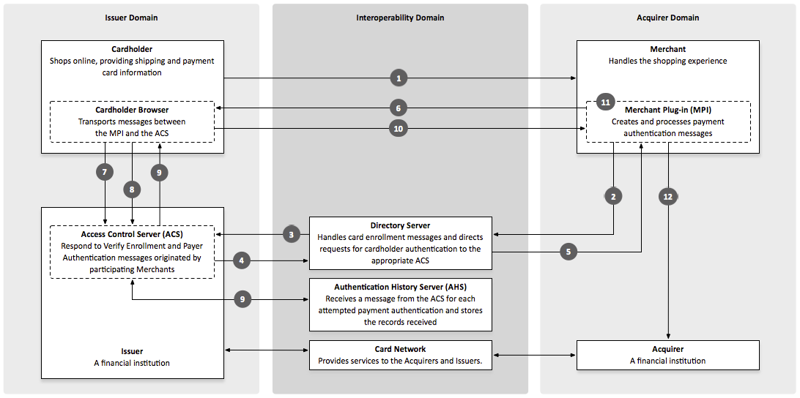

.. _Chap4-3DSecureIntegration:

==================================
Chapter 4 - 3-D Secure Integration
==================================
-------------
Introduction
-------------
Overview
  This chapter describes how you should implement 3-D Secure Authentication using the Remote REST API model.

Description
  This process involves redirecting the shopper to an authentication page. 
  This page is provided and hosted by the shopper's Card Issuer.
  As this page is hosted by the shopper’s card issuing bank, we have no control over its appearance or functionality.

---------------- 
About 3-D Secure
----------------
3-D Secure History
  In early 2001, VISA introduced a security protocol called 3-D Secure to improve online transaction performance and 
  to accelerate the growth of electronic commerce through increased consumer confidence. 

Objective of 3-D secure
  The objective of 3-D Secure was to provide Issuers with the ability to actually authenticate cardholders during 
  an online purchase, to reduce the likelihood of fraudulent usage of payment cards and to improve transaction performance to benefit merchants, consumers and acquirers.
  VISA’s branded 3-D Secure Program is commonly known as Verified By VISA (VbV). 
  Services based on the protocol have been also been adopted by MasterCard, under the name MasterCard SecureCode**™** (MSC).

------------------
Merchant Benefits
------------------
3-D-Secure Benefits
  The benefits of the 3-D Secure Process are the enhanced security available when performing an authenticated transaction 
  as well as the shift of liability in the event of fraudulent transactions. Authentication should strengthen your existing anti-fraud strategy and 
  help protect your business, but bear in mind that coverage of authentication programs is currently limited to Internet transactions. 
  
Restriction
  This means that authentication programs do not cover fax, mail, or phone orders (MO/TO), nor do they cover all card types.
  The additional security benefits and liability shifts of authenticated transactions are currently only supported by Visa and MasterCard.

------------------
Transaction Flow
------------------

Workflow overview
-----------------

:Login Screen:

 
   
Procedure
----------
Proceed as follow to carry out a transaction:

====== 	======================================================================================================================================================================================================================================================================================================================
Step    Action
====== 	======================================================================================================================================================================================================================================================================================================================
**1**	To complete the purchase; the cardholder press the **Buy** or **Submit** button 

          - This activates the Merchant Plug-In (MPI) and initiates a transaction.
------  ----------------------------------------------------------------------------------------------------------------------------------------------------------------------------------------------------------------------------------------------------------------------------------------------------------------------
**2**	The MPI identifies the card number and sends it to the Directory Server to determine whether the card is in a participating card range.
------  ----------------------------------------------------------------------------------------------------------------------------------------------------------------------------------------------------------------------------------------------------------------------------------------------------------------------
**3**	If the Issuer is participating for the card range, the Directory sends a Verify Enrollment Request message to the Issuer ACS to determine whether authentication is available for the account number.
**4**   The ACS returns a Verify Enrolment Response to the Directory Server
        
		 **IF** Authentication is available for this card number…**THEN**…the response provides the URL of the ACS where the cardholder can be authenticated.
         **IF** Authentication is not available…**THEN**…the Merchant server receives a Cardholder Not Enrolled or Authentication Not Available message and returns the transaction to the Merchant’s commerce server to proceed with a standard transaction processing.
------  ----------------------------------------------------------------------------------------------------------------------------------------------------------------------------------------------------------------------------------------------------------------------------------------------------------------------
**5**   The Directory Server forwards the ACS response to the MPI.
**6**   The MPI sends an Authentication Request message to the cardholder s browser for routing to the ACS.
**7**   The cardholder s browser passes the Authentication Request to the ACS.
**8**   The ACS authenticates the cardholder.
**9**   The ACS creates, digitally signs, and sends an Authentication Response to the Merchant via the cardholder s browser. The ACS also sends transaction record to the Authentication History Server for storage.
**10**  The browser routes the Authentication Response back to the MPI.
**11**  The MPI validates the digital signature in the response, verifying that it is from a valid participating Issuer.
**12**  The Merchant formats and sends to its Acquirer an Authorization Request message, which includes information from the Issuer’s Authentication Response — including the CAVV and the ECI. The Acquirer passes the Authorization Request to the Card Network and the transaction completes through standard processing.
====== 	======================================================================================================================================================================================================================================================================================================================

-----------------------
Authentication Results
-----------------------
The following table lists the Enrolment message and status:

========================== 	========================================================================================================================================================================
Field Name        			Description
========================== 	========================================================================================================================================================================
token 						Card token.
brand 						Card brand. (e.g., VISA, MASTERCARD, AMERICANEXPRESS, MAESTRO).
pan 						Card number (up to 19 characters). Note that, due to the PCI DSS security standards, our system has to mask credit card numbers in any output (e.g., 549619******4769).
card_holder 				Cardholder name.
card_expiry_month 			Card expiry month (2 digits).
card_expiry_year 			Card expiry year (4 digits).
issuer 						Card issuing bank name. Do not rely on this value to remain static over time. Bank names may change over time due to acquisitions and mergers.
country 					Bank country code where card was issued. This two-letter country code complies with ISO 3166-1 (alpha 2).
========================== 	========================================================================================================================================================================

