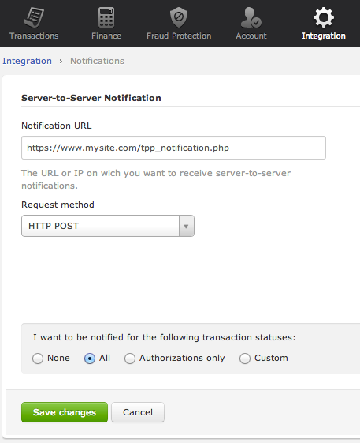

.. _Chap6-ServerToServer:

Chapter 6 - Server-to-Server
============================

What is a Server-to-Server Notification?
----------------------------------------
Description
  In order to notify events related to your payment system, such as a new transaction 
  or a 3-D Secure transaction, our platform can send to your application
  a Server-to-Server notification.

Setup
-----
Procedure
  To set your Notification URL you must login into your Hipay TPP back office 
  and go to *Integration -> Notifications*.

:Login Screen:

Configuration Parameters
------------------------

===================== 	===========================================================================
Field Name        		Description
===================== 	===========================================================================
Notification URL		The URL or IP on which you want to receive server-to-server notifications.
---------------------  	---------------------------------------------------------------------------
Request method			The method you wish to receive the requests:
							
						  - XML
						  - HTTP POST 
--------------------- 	---------------------------------------------------------------------------
Desired notifications	Payment Card Industry Data Security Standards
=====================  	===========================================================================

Response Fields
---------------
The following table lists and describes the response fields received on the notification call.

==========================  ===================================================================================================================================================================
Field Name                  Description
==========================  ===================================================================================================================================================================
state                       transaction state. Value must be a member of the following list.
							  
							  -	completed
							  -	pending
							  -	declined
							  -	error
								
                            Please report to the following section below — Transaction Workflow — for further details.
==========================  ===================================================================================================================================================================							
--------------------------	-------------------------------------------------------------------------------------------------------------------------------------------------------------------
reason                      optional element. Reason why transaction was declined.
test						Payment Card Industry Data Security Standards
mid							your merchant account number (issued to you by HiPay TPP).
Attempt_id					attempt id of the payment.
authorization_code			an authorization code (up to 35 characters) generated for each approved or pending transaction by the acquiring provider.
transaction_rerefence		the unique identifier of the transaction.
date_created				time when transaction was created.
Date_updated				time when transaction was last updated.
date_authorized				time when transaction was authorized.
--------------------------	-------------------------------------------------------------------------------------------------------------------------------------------------------------------
status						transaction status.

							A list of available statuses can be found in the appendices.
							appendices – Appendix B *Payment Status Definitions*.
--------------------------	-------------------------------------------------------------------------------------------------------------------------------------------------------------------
message						transaction message.
authorized_amount			the transaction amount.
captured_amount				captured amount.
refunded_amount				refunded amount.
decimals					decimal precision of transaction amount.
-------------------------- 	-------------------------------------------------------------------------------------------------------------------------------------------------------------------
currency					base currency for this transaction.

							This three-character currency code complies with ISO 4217.
-------------------------- 	-------------------------------------------------------------------------------------------------------------------------------------------------------------------
ip_address					the IP address of the customer making the purchase.				
ip_country					country code associated to the customer's IP address.
device_id					unique identifier assigned to device (the customer's brower) by HiPay TPP.
cdata1						custom data.
cdata2						custom data.
cdata3						custom data.
cdata4						custom data.
-------------------------- 	-------------------------------------------------------------------------------------------------------------------------------------------------------------------
avs_result					result of the Address Verification Service (AVS).

							Possible result codes can be found in the appendices
--------------------------	-------------------------------------------------------------------------------------------------------------------------------------------------------------------
cvc_result					result of the CVC (Card Verification Code) check.

							Possible result codes can be found in the appendices
--------------------------	-------------------------------------------------------------------------------------------------------------------------------------------------------------------						
eci							Electronic Commerce Indicator (ECI).
--------------------------	-------------------------------------------------------------------------------------------------------------------------------------------------------------------
payment_product				payment product used to complete the transaction.

							Informs about the payment_method section type
--------------------------	-------------------------------------------------------------------------------------------------------------------------------------------------------------------
payment_method				See tables below for further details.
--------------------------	-------------------------------------------------------------------------------------------------------------------------------------------------------------------
Three_d_secure				optional element. Result of the 3-D Secure Authentication.
  1. eci					 1. the 3-D Secure (3DS) electronic commerce indicator time when order was created.
  2. enrollment_status		 2. the enrollment status. 
  3. enrollment_status 		 3. the enrollment message
  4. authentication_status 	 4. the authentication status. This field is only included if payment authentication was attempted and a value was received.
  5. authentication_message	 5. the authentication message. This field is only included if payment authentication was attempted and a value was received.
  6. authentication_token	 6. this is a value generated by the card issuer as a token to prove that the cardholder was successfully authenticated.
  7. xid					 7. a unique transaction identifier that is generated by the payment server on behalf of the merchant to identify the 3DS transaction.		
--------------------------	-------------------------------------------------------------------------------------------------------------------------------------------------------------------
Fraud_screening				Result of the fraud screening.
  - scoring					  - total score assigned to the transaction (main risk indicator).
  - result					  - The overall result of risk assessment returned by the Payment Gateway.Value must be a member of the following list.
							  
							    a) pending    :rules were not checked.
							    b) accepted   :transaction accepted.
							    c) blocked    :transaction rejected due to system rules.
							    d) challenged :transaction has been marked for review.
								
  - review					  - The decision made when the overall risk result returns challenged.

							  - An empty value means no review is required.
							  - Value must be a member of the following list.
								
							    a) pending   :a decision to release or cancel the transaction is pending.
                                b) allowed   :the transaction has been released for processing.
							    c) denied    :the transaction has been cancelled.
--------------------------	-------------------------------------------------------------------------------------------------------------------------------------------------------------------
Order						information about the customer and his order.
  - Id						- unique identifier of the order as provided by Merchant.
  - dateCreated				- time when order was created. 
  - attempts				- indicates how many payment attempts have been made for this order.
  - amount					- the total order amount (e.g., 150.00). It should be calculated as a sum of the items purchased, plus the shipping fee (if present), plus the tax fee (if present).
  - shipping				- the order shipping fee.
  - tax						- the order tax fee.
  - decimals				- decimal precision of the order amount.
  - currency				- base currency for this order.This three-character currency code complies with ISO 4217
  - customer_id				- unique identifier of the customer as provided by Merchant.
  - language				- language code of the customer.
  - email					- email address of the customer.
========================== 	===================================================================================================================================================================

Response fields specific to the payment product
-----------------------------------------------

Credit Card payments
  The following table lists and describes the response fields returned for transactions by credit/debit card.
	
========================== 	===================================================================================================================================================================
Field Name        			Description
========================== 	===================================================================================================================================================================
token 						Card token.
brand 						Card brand. (e.g., VISA, MASTERCARD, AMERICANEXPRESS, MAESTRO).
pan 						Card number (up to 19 characters). Note that, due to the PCI DSS security standards, our system has to mask credit card numbers in any output (e.g., 549619******4769).
card_holder 				Cardholder name.
card_expiry_month 			Card expiry month (2 digits).
card_expiry_year 			Card expiry year (4 digits).
issuer 						Card issuing bank name. Do not rely on this value to remain static over time. Bank names may change over time due to acquisitions and mergers.
country 					Bank country code where card was issued. This two-letter country code complies with ISO 3166-1 (alpha 2).
========================== 	===================================================================================================================================================================

QIWI payments
  The following table lists and describes the response fields returned for transactions by VISA QIWI Wallet.

========================== 	===================================================================================================================================================================
Field Name        			Description
========================== 	===================================================================================================================================================================
user						The Qiwi user's ID, to whom the invoice is issued. It is the user's phone number, in international format. Example: +79263745223
========================== 	===================================================================================================================================================================

Transaction Workflow
--------------------

Description
  The HiPay TPP payment gateway can process transactions through many different acquirers using different payment methods and involving some anti-fraud checks. 
  All these aspects change the transaction processing flow significantly for you.
  When you activate a server-to-server notification on Hipay TPP, you receive a response describing the transaction state. 
  Depending on the transaction state there are five options to action:

========================== 	===================================================================================================================================================================
Transaction state   		Description
========================== 	===================================================================================================================================================================
completed 					if the transaction state is completed you are done. This is the most common case for credit card transaction processing. Almost all credit card acquirers works in that way. Then you have to look into the status fied of the response to know the exact transaction status.
pending 					Transaction request was submitted to the acquirer but response is not yet available.
declined  					Transaction was processed and was declined by gateway.
error 						Transaction was not processed due to some reasons.
========================== 	===================================================================================================================================================================

Examples
--------

The following are examples XML and HTTP Post responses.

XML Response Example
		
.. code-block:: xml
    :linenos:

  	<?xml version="1.0" encoding="UTF-8"?>
  	<notification>
   	  <state>completed</state>
  	  <reason/>
   	  <test>true</test>
   	  <mid>00001326581</mid>
   	  <attempt_id>1</attempt_id>
   	  <authorization_code>test123</authorization_code>
   	  <transaction_reference>388997073285</transaction_reference>
   	  <date_created>2012-10-14T12:29:51+0000</date_created>
   	  <date_updated>2012-10-14T12:29:55+0000</date_updated>
   	  <date_authorized>2012-10-14T12:29:54+0000</date_authorized>
   	  <status>117</status>
   	  <message>Capture Requested</message>
   	  <authorized_amount>5.00</authorized_amount>
   	  <captured_amount>5.00</captured_amount>
   	  <refunded_amount>0.00</refunded_amount>
   	  <decimals>2</decimals>
   	  <currency>EUR</currency>
   	  <ip_address>83.167.62.196</ip_address>
   	  <ip_country>FR</ip_country>
   	  <device_id/>
   	  <cdata1><![CDATA[My data 1]]></cdata1>
   	  <cdata2><![CDATA[My data 2]]></cdata2>
   	  <cdata3><![CDATA[My data 3]]></cdata3>
   	  <cdata4><![CDATA[My data 4]]></cdata4>
   	  <avs_result/>
   	  <cvc_result/>
   	  <eci>9</eci>
   	  <payment_product>visa</payment_product>
   	  <payment_method>
   	    <token>ce5x096fx6xx05989x170x7x96f94432600491xx</token>
   	    <brand>VISA</brand>
   	    <pan>400000******0000</pan>
   	    <card_holder>Jhon Doe</card_holder>
   	    <card_expiry_month>07</card_expiry_month>
   	    <card_expiry_year>2015</card_expiry_year>
   	    <issuer>MY BANK</issuer>
   	    <country>FR</country>
   	  </payment_method>
   	  <three_d_secure>
   	    <eci>5</eci>
   	    <enrollment_status>Y</enrollment_status>
   	    <enrollment_message>Authentication Available</enrollment_message>
   	    <authentication_status>Y</authentication_status>
   	    <authentication_message>Authentication Successful</authentication_message>
   	    <authentication_token></authentication_token>
   	    <xid></xid>
   	  </three_d_secure>
   	  <fraud_screening>
   	    <scoring>120</scoring>
   	    <result>accepted</result>
   	    <review/>
   	  </fraud_screening>
   	  <order>
   	    <id>1381753783</id>
   	    <date_created>2012-10-14T12:29:51+0000</date_created>
   	    <attempts>1</attempts>
   	    <amount>5.00</amount>
   	    <shipping>10.00</shipping>
   	    <tax>0.98</tax>
   	    <decimals>2</decimals>
   	    <currency>EUR</currency>
   	    <customer_id>UID1381753791</customer_id>
   	    <language>fr_FR</language>
   	    <email>customer@mail.com</email>
   	  </order>
   	</notification>

:HTTP POST Response Example:
		
.. code-block:: php
    :linenos:

   	state = completed
  	reason = 
  	test = false
  	mid = 00001326581
   	attempt_id = 1
   	authorization_code = test123
   	transaction_reference = 781357613392
   	date_created = 2012-10-14T13:10:36+0000
   	date_updated = 2012-10-14T13:10:38+0000
   	date_authorized = 2012-10-14T13:10:38+0000
   	status = 116
   	message = Authorized
   	authorized_amount = 5.00
   	captured_amount = 0.00
   	refunded_amount = 0.00
  	decimals = 2
   	currency = EUR
   	ip_address = 83.167.62.196
   	ip_country = FR
   	device_id = 
   	cdata1 = My data 1
   	cdata2 = My data 2
   	cdata3 = My data 3
   	cdata4 = My data 4
   	avs_result = 
   	cvc_result = 
   	eci = 7
   	payment_product = visa
   	payment_method[token] = ce5x096fx6xx05989x170x7x96f94432600491xx
   	payment_method[brand] = VISA
   	payment_method[pan] = 400000******0000
   	payment_method[card_holder] = Jhon Doe
   	payment_method[card_expiry_month] = 07
   	payment_method[card_expiry_year] = 2015
   	payment_method[issuer] = MYBANK 
   	payment_method[country] = FR 
   	three_d_secure[eci] = 5
   	three_d_secure[enrollment_status] = Y
   	three_d_secure[enrollment_message]=Authentication Available
   	three_d_secure[authentication_status]=Y
   	three_d_secure[authentication_message]=Authentication Successful
   	three_d_secure[authentication_token]=
   	three_d_secure[xid]=
   	fraud_screening[scoring] = 120
   	fraud_screening[result] = accepted
   	fraud_screening[review] = 
   	order[id] = 1381756231
   	order[date_created] = 2013-10-14T13:10:36+0000
   	order[attempts] = 1
   	order[amount] = 5.00
   	order[shipping] = 10.00
   	order[tax] = 0.98
   	order[decimals] = 2
   	order[currency] = EUR
   	order[customer_id] = UID1381756236
   	order[language] = fr_FR
   	order[email] = customer@mail.com

	
	
 	
	
	
		
		