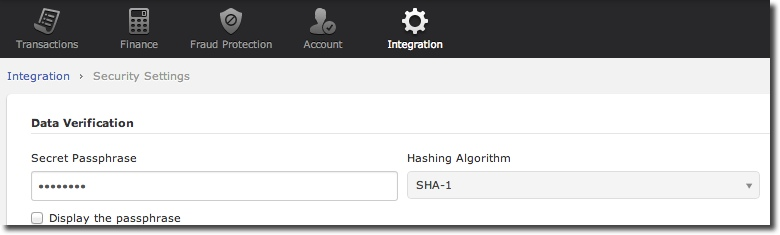

.. _Chap7-Signatureverif:

===================================
Chapter 7 - Signature verification
===================================
-------------
Introduction
-------------
Directive

  It is strongly recommended to use a signature mechanism to verify the contents of a request or redirection made to your servers. This prevents customers from tampering with the data in the data exchanges between your servers and our payment system.
  A unique signature is sent each time that HiPay contact a merchant URL, notification or redirection.

------
Setup
------
Procedure

  First of all you need to set a Secret Passphrase in your HiPay TPP back office 
  under *Integration -> Security Settings -> Secret Passphrase*.

:Login Screen:

Secret passphrase

  The secret passphrase is used to generate a unique character string (signature) hashed with SHA algorithm.
  The security level of the password idepends on the length of the password. 
  A long password is more secured.

--------------
Verification
--------------

URL Notification
----------------

Description

  For the URL notification, the signature is sent on the HTTP header under the *HTTP_X_ALLOPASS_SIGNATURE parameter* 

Verification

  To check this point, you just need to concatenate the passphrase with the POST content of the query.

  Algorithm verification
 
   *Algorithm:*
    *SHA Signature = SHA1(Raw POST Data + Secret Passphrase)*

URL Redirection
---------------

Description

  For each redirection page (accept page, decline page, etc.) the signature is sent under the *hash* parameter,
  
Verification

  To check this point, you must to concatenate the parameters, the values of each and the passphrase under the following conditions:

	a) The parameter must be predefined.
	b) The value can't be empty.
	c) The parameter must be sorted in alphabetical order.

  Algorithm verification
   *Algorithm*
  
   a) paramC = val3
   b) paramA = val1
   c) paramB = val2
	
	*SHA Signature = SHA1SHA1(paramAval1<passphrase>paramBval2<passphrase>paramCval3<passphrase>)*

--------	
Example
--------

PHP Signature Validation
		
.. code-block:: php
    :linenos:

   	$secretPassphrase = 'mypassphrasse';       				//Secret Passphrase 
   	$string2compute = '';
   	if (isset($_GET['hash'])) {   						// If is a redirection URL
   		$signature = $_GET['hash'];
   		$parameters = $_GET;
   		unset($parameters['hash']);
   		ksort($parameters);
   		foreach ($parameters as $name => $value) {
   			if (strlen($value)>0) {
   		    		$string2compute .= $name . $value . $secretPassphrase;
   			}
   		}
   	}
   	else {									// If is a Notification
   		$signature = $_SERVER['HTTP_X_ALLOPASS_SIGNATURE'];
   		$string2compute = $HTTP_RAW_POST_DATA . $secretPassphrase;
   	}
   	$computedSignature = sha1($string2compute);
   	// true if OK, false if not
   	if ($computedSignature == $signature) {
   	    $message = 'OK';
   	}
   	else {
   	    $message = 'KO';
   	}

	
	
 	
	
	
		
		